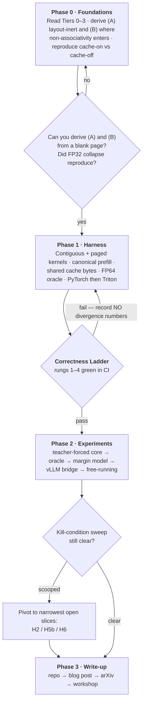
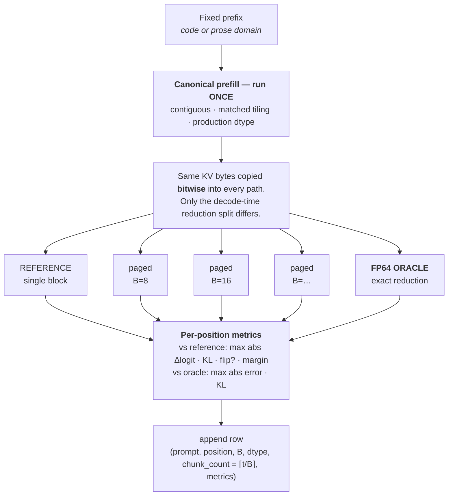

# WAFT
# Block Size Is an Implicit Numerical Parameter

> How paged KV-cache block size changes the tokens a language model generates.

**Status:** spec frozen · Phase 0 (foundations) · next milestone = bitwise-identity gate green in CI

---

## TL;DR

Serving systems (vLLM, TGI, SGLang) pick a KV-cache `block_size` for **memory** reasons. But block size also sets the **chunking of the online-softmax reduction** — and floating-point addition isn't associative. So `block_size` is silently a *numerical* parameter that can change the generated tokens.

This repo is a controlled testbed that measures exactly how much, with what structure, and when it flips a greedy argmax.

**The framing precision that makes this work:** paged *layout* is numerically inert — a block-table gather changes addresses, not arithmetic. The causal variable is the **reduction split** that block size controls.

---

## Hypotheses

| ID | Claim | Mode |
|----|-------|------|
| **H1** | Matched chunking ⇒ paged and contiguous are *bitwise identical* (mechanism; a corollary, not the headline) | Bitwise gate |
| **H2** | Per-position divergence grows with chunk count ⌈t/B⌉ — a **staircase**, not boundary spikes | Teacher-forced |
| **H3** | Block-size **dose-response** in divergence and argmax-flip rate | Teacher-forced |
| **H4** | GQA **amplifies** the effect vs. a materialized-MHA control | Teacher-forced |
| **H5a** | Divergence grows FP32 → FP16 → BF16 as mantissa bits drop | Teacher-forced |
| **H5b** | vs. an **FP64 oracle**, the serving default may not be the *most accurate* block size | Oracle scoring |
| **H6** | Flips are predictable from top-1/top-2 **logit margin** → "≈X flips per 1,000 tokens" | Logistic fit |

---

## Pipeline



---

## The core measurement

Every experiment is this path, repeated over prompts × block sizes × precisions.



**Statistical rule:** the sampling unit is the **prompt** (cluster bootstrap). Positions are repeated measures within a prompt. Runs are never resampled — both paths are deterministic on fixed hardware.

---

## Correctness ladder

No divergence number is recorded until all four are green in CI.

| Rung | Check | Why it matters |
|------|-------|----------------|
| **1** | **Bitwise identity** — `block = seqlen` ⇒ bit-for-bit identical to contiguous | Stronger than an FP32 tolerance test; catches gather/index bugs that FP32 would hide |
| **2** | FP64 oracle exists and scores every config | Enables H5b (accuracy, not just sensitivity) |
| **3** | FP32 collapse — FP32 storage+accum ⇒ divergence drops orders of magnitude | Confirms rounding, not kernel logic, is the driver |
| **4** | Determinism — same run, same hardware ⇒ bitwise identical | Run once per config, then never repeat for statistics |

**Standing confound guard:** pin all Triton/backend autotune configs and record them. Timing-based autotuning silently changes reduction order — that's the real methods threat. Thermal throttling is a red herring; it doesn't change numerics.

---

## Three decisions fixed before any kernel

1. **Accumulator precision.** Production kernels store K/V in BF16/FP16 but accumulate the online-softmax stats and output in **FP32**. Reference config = low-precision storage + FP32 accumulate. A low-precision-accumulate kernel would inflate the effect and a reviewer would rightly object.
2. **Merge topology.** Default is a **sequential fold** (the common production pattern), not a tree — so pairwise-summation accuracy intuitions don't automatically transfer. H5b is stated conditionally on this.
3. **Cache-byte provenance.** Prefill runs **once**, canonically; its bytes are shared bitwise across every compared path. Otherwise measured divergence mixes prefill-side rounding with the decode-time reduction split.

---

## Scope control

**Minimum publishable core — finish completely before any optional arm:**
BF16/FP32-accum · Qwen2.5-0.5B · sequential fold · block sweep · teacher-forced · both domains · FP64 oracle · margin model · ladder rungs 1–4.
→ Delivers **H1 + H2 + H3 + H5b + H6** = a complete paper.

<details>
<summary><b>Add order</b> (only after the core is done)</summary>

vLLM bridge → free-running summary → FP16/FP32 storage columns (H5a) → GQA control (H4) → low-precision-accumulator figure → MHA cross-check model → tree-topology arm.
</details>

<details>
<summary><b>Cut order</b> (when time runs short)</summary>

tree-topology → Pythia/GPT-2 cross-check → low-precision-accum arm → H4/GQA entirely (most severable; the arc survives without it).

**Never cut:** vLLM bridge · free-running summary · both prompt domains · FP64 oracle · margin model · correctness ladder.
</details>

---

## Positioning

| Work | Axis | Gap this fills |
|------|------|----------------|
| Chodavarapu & Xu, *Illusion of Equivalence* (arXiv:2604.15409) | cache-on vs. cache-off | No paging apparatus; block size never varied |
| Thinking Machines, *Defeating Nondeterminism* (2025) + batch-invariance line | batch size / sequence slicing | Engineering fix, not a characterization; different axis |

The *existence* claim here is close to folklore among inference engineers. **The contribution is characterization, accuracy analysis, and a predictive model** — not discovery of a phenomenon. Folklore without characterization is exactly what a measurement paper exists to fix.

---

## Setup

```bash
git clone <repo-url> && cd <repo>
python -m venv .venv && source .venv/bin/activate
pip install -r requirements.txt

pytest tests/test_correctness_ladder.py   # rungs 1–4 — must pass before any experiment
```

**Hardware:** single consumer GPU. This is a controlled-isolation study, not a scale study — a 0.5B model makes thousands of controlled teacher-forced measurements affordable and keeps single-variable isolation clean. Datacenter scale would tangle the variables back together. The constraint is the method.

---

## Tier

Workshop paper or a clean, citable arXiv preprint — not a flagship systems paper. The value is rigorous novel measurement plus a small predictive model, not a new system.

## License

MIT
